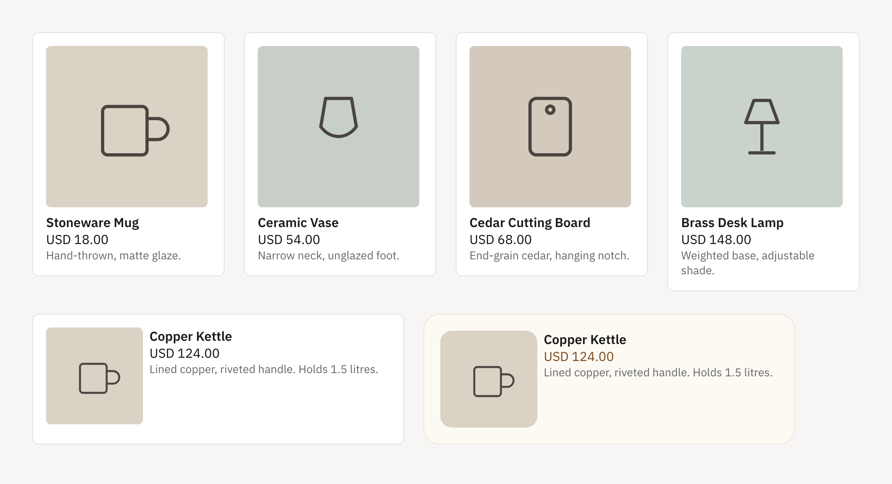

# Kit

A framework-neutral-data, Svelte-rendered `ProductCard` component.



Above: `imageSize="md"` cards in a grid, and `orientation="horizontal"` cards —
the second restyled entirely through CSS custom properties.

## What?

Kit provides:

- **`ProductCard`**: a Svelte 5 component that renders a product (image,
  title, price, description) from a plain, normalized `Product` object.
- **Generic `Product` type**: platform-agnostic — not shaped after any one
  backend. Generated from a YAML spec, with runtime decoders included.
- **Prop/CSS-variable driven customization**: consumers configure the card
  via props (`imageSize`, `showDescription`, etc.) and CSS custom properties
  (`--card-radius`, `--card-gap`, etc.) without forking the source.

## Why?

Anyone fetching product data (Shopify, WooCommerce, a custom backend, etc.)
needs a way to display it without hand-rolling a card component per project.
Kit owns the presentation layer only — you own fetching and mapping your
platform's data into the `Product` shape.

## Architecture

### Core Components

- **`ProductCard`** (`src/lib/ui/product-card.svelte`): the exported card
  component.
- **`Product` / `ProductImage` / `ProductVariant`**: generated from
  `schema/product.yaml` via [type-crafter](https://github.com/sinha-sahil/type-crafter)
  into `src/generated/types/`, including runtime decoders
  (`decodeProduct`, etc.) for validating untrusted input.

### Tech Stack

- **Frontend**: Svelte 5 (runes) with TypeScript
- **Build Tool**: Vite / `@sveltejs/package`
- **Package Manager**: pnpm

## Getting Started

### Prerequisites

- Node.js 18+
- pnpm

### Installation

```bash
git clone <repository-url>
cd kit
pnpm install
```

### Development

```bash
pnpm dev      # start the demo app (src/App.svelte) against the live component
```

### Building

```bash
pnpm build    # build the demo app (verification only)
pnpm package  # build the publishable package into ./package
```

## Usage

```bash
npm install @yasmee_ogo/kit
```

```svelte
<script lang="ts">
  import { ProductCard } from '@yasmee_ogo/kit';
  import type { Product } from '@yasmee_ogo/kit';

  const product: Product = {
    id: '1',
    title: 'Classic Tee',
    description: 'A comfortable, everyday cotton t-shirt.',
    images: [{ url: 'https://cdn.example.com/tee.jpg', alt: 'Classic Tee' }],
    price: '24.99',
    currency: 'USD',
    availability: true,
    sku: null,
    vendor: null,
    variants: null
  };
</script>

<ProductCard {product} imageSize="lg" onSelect={(p) => console.log('selected', p)} />
```

### Adapters

Kit renders products; it does not fetch or reshape them. A **`ProductAdapter`**
is the integration point for a data source — the same shape kavach and forklift
use, a plain object you implement and hand to Kit:

```ts
import type { ProductAdapter } from '@yasmee_ogo/kit';

export type ProductAdapter = {
  toProduct: (source: unknown) => Product | null;
  toProducts: (source: unknown) => Product[];
};
```

Kit ships no platform-specific adapters on purpose: that would tie its release
cadence to APIs it does not control. You write the one you need — either by
hand, or with the `createProductAdapter` helper below when the mapping is
mostly field-for-field.

```ts
import { createProductAdapter, select } from '@yasmee_ogo/kit';

const adapter = createProductAdapter({
  id: 'id',
  title: 'title',
  price: 'priceRange.minVariantPrice.amount',
  currency: 'priceRange.minVariantPrice.currencyCode',
  availability: 'availableForSale',
  images: { path: 'images.edges[].node', url: 'url', alt: 'altText' },
  variants: { path: 'variants.edges[].node', id: 'id', price: 'price.amount', sku: 'sku' }
});

const products = adapter.toProducts(select(data, 'products.edges[].node'));
```

Each field is either a **path string** or a **function** for anything a path
cannot express:

```ts
const adapter = createProductAdapter({
  id: 'sku',
  title: 'name',
  price: (source) => (source.cents / 100).toFixed(2), // minor units
  availability: (source) => source.stock_status === 'instock',
  images: { path: 'images', url: 'src', alt: 'alt' }
});
```

#### Paths

`select` reads nested values without throwing on a missing segment:

| Path                    | Reads                                                     |
| ----------------------- | --------------------------------------------------------- |
| `priceRange.min.amount` | Nested properties                                         |
| `variants.0.price`      | An array index                                            |
| `images.edges[].node`   | Flattens the array at `[]` — unwraps a GraphQL connection |
| `images.src`            | A key read across every entry of an array                 |

#### Behaviour

- `toProduct` returns `null` when a source lacks an id, title, or price, so bad
  entries can be filtered rather than rendering a broken card. `toProducts`
  drops them for you.
- `price` falls back to the first variant's price when the top-level path
  misses; `sku` falls back the same way.
- Numbers are stringified, so a numeric `id` or `price` needs no conversion.
- Duplicate image URLs are dropped, which handles sources that repeat a
  featured image in the main image list.
- Prices are never reinterpreted. If your source stores minor units, convert
  them in a selector function.

### Mapping platform data

`Product` is intentionally generic — it isn't a 1:1 mirror of Shopify,
WooCommerce, or any single platform. Map your platform's response into this
shape before passing it to `ProductCard`. See `docs/PLAN.md` for a
field-by-field comparison against Shopify's Storefront API, schema.org, and
WooCommerce.

## Props

| Prop               | Type                             | Default      | Purpose                                                                       |
| ------------------ | -------------------------------- | ------------ | ----------------------------------------------------------------------------- |
| `product`          | `Product`                        | **required** | The product data to render                                                    |
| `imageSize`        | `'sm' \| 'md' \| 'lg' \| number` | `'md'`       | Image dimensions — `sm` 120px, `md` 200px, `lg` 320px; a number is used as-is |
| `orientation`      | `'vertical' \| 'horizontal'`     | `'vertical'` | Stack the image above the details, or beside them                             |
| `showDescription`  | `boolean`                        | `true`       | Render the description when the product has one                               |
| `classes`          | `string`                         | `''`         | Custom classes on the card element itself                                     |
| `titleClass`       | `string`                         | `''`         | Custom classes on the title                                                   |
| `priceClass`       | `string`                         | `''`         | Custom classes on the price                                                   |
| `descriptionClass` | `string`                         | `''`         | Custom classes on the description                                             |
| `onSelect`         | `(product: Product) => void`     | —            | Called when the card is clicked                                               |

### Layout

`imageSize` drives the whole card: the card takes its width from the image, so
one prop scales it. In a grid, the track and the card agree without either
being told about the other.

```svelte
<div class="grid">
  {#each products as product (product.id)}
    <ProductCard {product} imageSize="md" />
  {/each}
</div>

<style>
  .grid {
    display: grid;
    grid-template-columns: repeat(4, minmax(0, 1fr));
    gap: 24px;
    align-items: start;
  }
</style>
```

`orientation="horizontal"` puts the image beside the details — better suited to
cart rows and order lists, and best paired with a small image. Horizontal cards
have no intrinsic width, so set `--card-width`:

```svelte
<ProductCard {product} imageSize="sm" orientation="horizontal" classes="cart-row" />

<style>
  :global(.cart-row) {
    --card-width: 460px;
  }
</style>
```

## Styling

Every visual decision reads from a CSS custom property with a fallback, so you
restyle the card from the outside without forking it.

| Property                   | Default       | Applies to                           |
| -------------------------- | ------------- | ------------------------------------ |
| `--card-gap`               | `0.5rem`      | Space between the image and the body |
| `--card-padding`           | `1rem`        | Card padding                         |
| `--card-radius`            | `0.5rem`      | Card corner radius                   |
| `--card-border-color`      | `#e2e2e2`     | Card border                          |
| `--card-background`        | `#fff`        | Card background                      |
| `--card-price-color`       | `#111`        | Price text                           |
| `--card-description-color` | `#666`        | Description text                     |
| `--card-image-radius`      | `0.375rem`    | Image corner radius                  |
| `--card-width`             | `fit-content` | Card width — horizontal only         |

The `classes` prop is the recommended way to apply a theme variant: define a
class that sets the properties, then pass its name.

```svelte
<ProductCard {product} classes="card-warm" />

<style>
  :global(.card-warm) {
    --card-radius: 20px;
    --card-padding: 20px;
    --card-border-color: #ece4d8;
    --card-background: #fdfaf4;
    --card-price-color: #7a4a1d;
    --card-image-radius: 14px;
  }
</style>
```

## Types

Regenerate types after editing `schema/product.yaml`:

```bash
pnpm run generate:types
```

This runs `type-crafter generate typescript-with-decoders`, then lints and
formats the output in `src/generated/types/`. The generated `.ts` files are
committed; only `.d.ts` build output is gitignored.

## Development Scripts

| Script                    | Description                                 |
| ------------------------- | ------------------------------------------- |
| `pnpm dev`                | Start Vite dev server with the demo app     |
| `pnpm build`              | Build the demo app                          |
| `pnpm package`            | Build the publishable package               |
| `pnpm check`              | Run TypeScript and Svelte checks            |
| `pnpm lint`               | Run ESLint                                  |
| `pnpm format`             | Run Prettier                                |
| `pnpm run generate:types` | Regenerate types from `schema/product.yaml` |

## Releasing

Versioning and publishing to npm are handled by [Changesets](https://github.com/changesets/changesets),
run manually (there's no CI/automated release workflow currently):

1. Run `pnpm changeset` and describe your change — this writes a markdown file under
   `.changeset/`. Commit it alongside your code changes.
2. Run `pnpm version` (= `changeset version`) to bump `package.json` and update `CHANGELOG.md`
   based on pending changesets. Commit the result.
3. Run `pnpm release` (= `pnpm package && changeset publish`) to build the package and publish
   the new version to npm as `@yasmee_ogo/kit`.

Publishing requires you to be logged in locally via `npm login` under an account with publish
access to the `@yasmee_ogo` scope.

## Contributing

1. Fork the repository
2. Create a feature branch
3. Make your changes
4. Run `pnpm check` and `pnpm lint` to validate
5. Submit a pull request

## License

MIT
